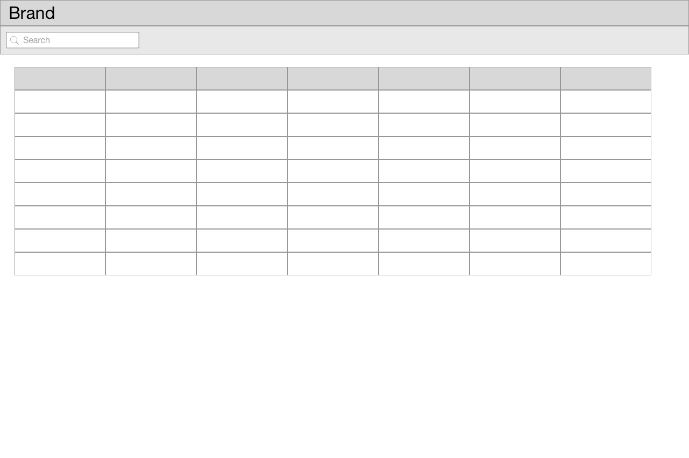
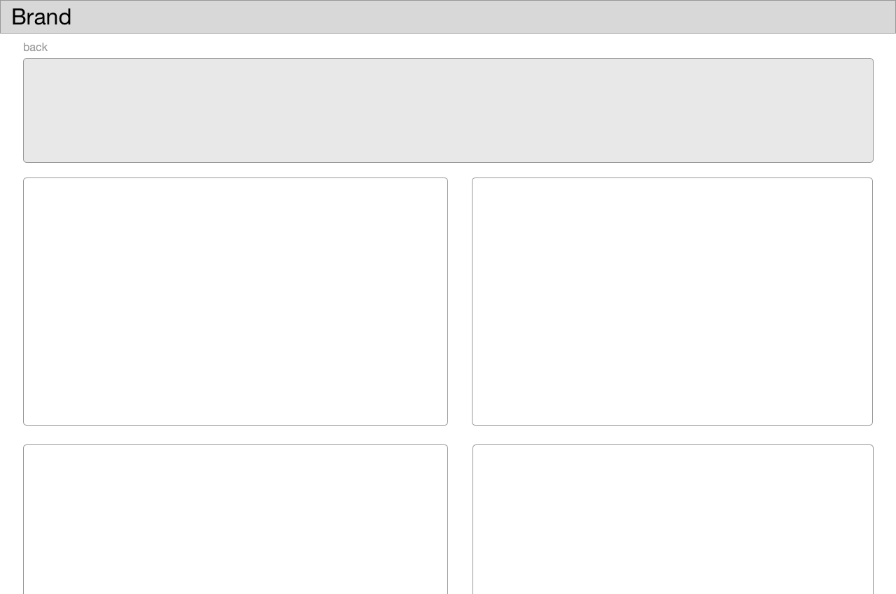
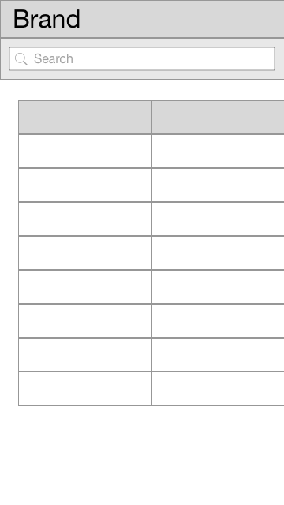
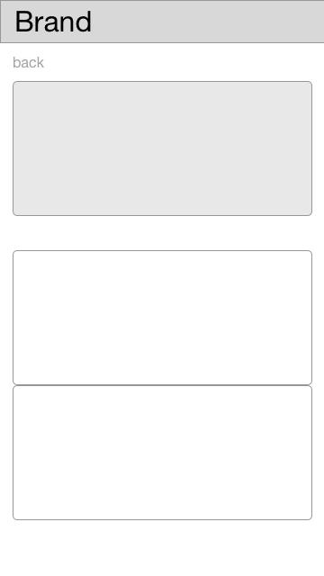
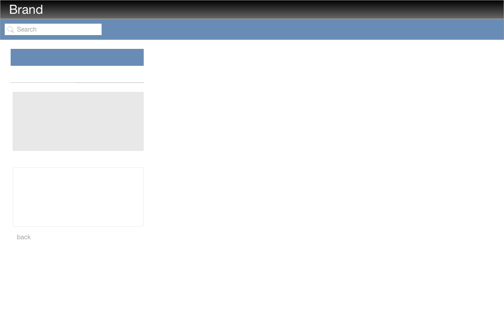

# Design

## Layout

 * Base font 16px (1rem), Helvetica Neue
 * Basic spacing
    * Horizontal 2rem
    * Verizontal 1rem

## Heading

Composed of:

 * Brand logo/name
 * Height 3rem
 * Font size: 2rem

### List page

 * Tools bar
   * Search across all fields (nested)
     * Should filter on keyup
 * Table
   * Sortable one each field
   * Fields
    * Date
    * Debtor (name)
    * Beneficient (name)
    * Sponsor (name)
    * Amount
    * Currency
    * Reference    

### Details page

 * Main section
    * Reference
    * Amount
    * Processing date
     
 * Detail containers
    * Debtor
    * Beneficient
    * Sponsor
    * Fixture
    * Charges information
    * payment_*
    * scheme_* 

## Composition

## Mobile

List scrollabe horizontally

Single column

## Branding

    * Heading
        * Gradient - line #000 - #6A6969
        * Text - white
    * Toolbar
        * Background #688CB5
        * Font and lines #A2A2A2
    * Main section
        * Background: #E8E8E8
        * no borders
    * Other wells
        * border #E8E8E8
        * transparent